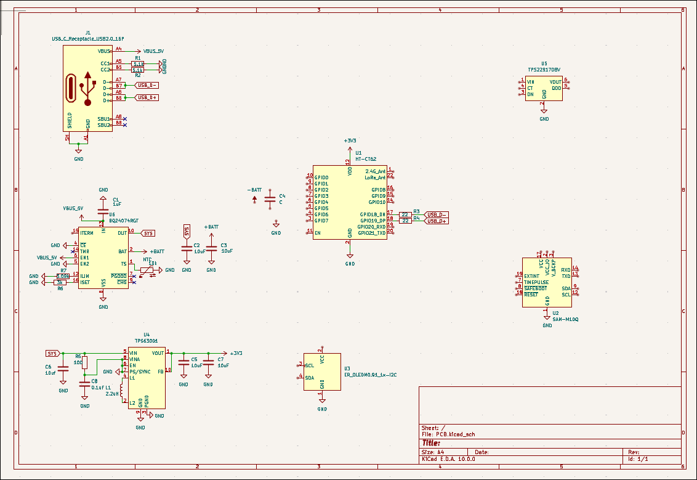
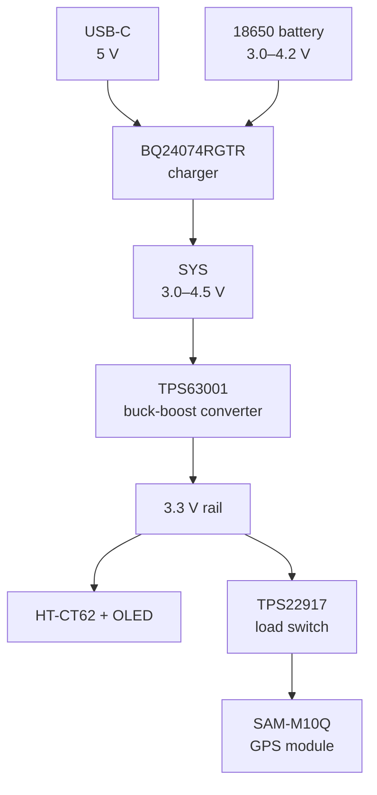
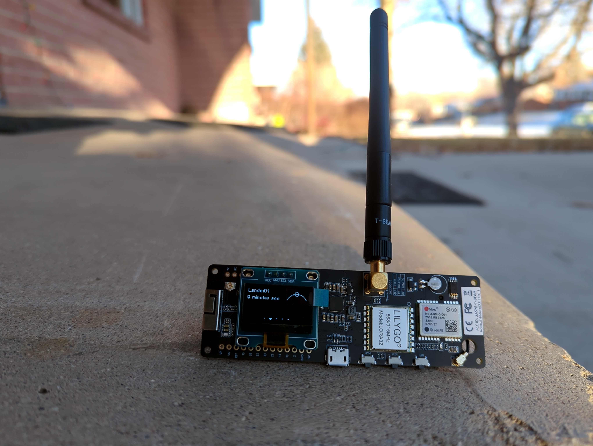
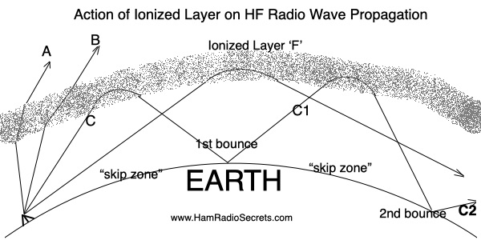
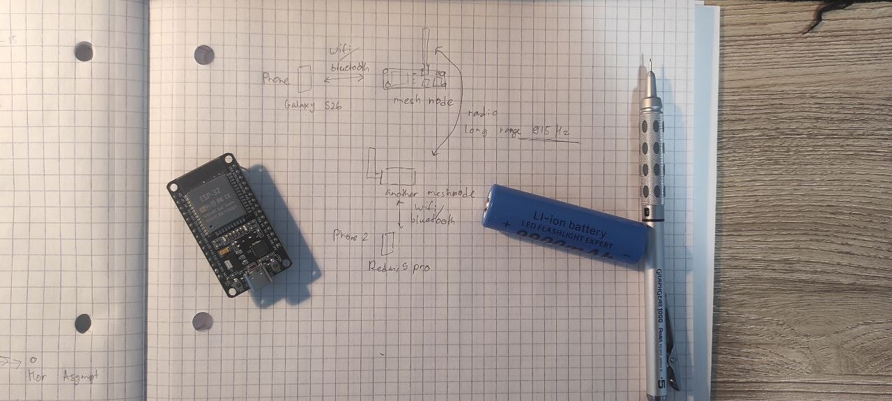

# August 21st 

This day I continued the schematic and as I didn't have much time I just did the oled screen pretty quickly. 

# August 20th

Today I decided to choose a gps/gnss module or a chip. 
Turns out that standard gnss has precision of 3-10m so it is what I need 

Turns out that there are bunch of sattelite systems.

Reading a bit I chose the SAM-M10Q module since it is a low-cost gnss module which incorporates built-in chip, circuitry, and antenna.

Then I started reading datasheet of ht-ct62 and then sx1262. 

Also I then checked the firmware for ht-ct62. Thank God it was available. 

For the display I chose ssd1306 since it is a low-cost OLED display module. 

Since I do want to have a 18650 battery power supply, I need to have a buck boost converter that can step up and step down the voltage.

So the whole thing would be something like this: 

I then set up the usb_c and charging IC bq24074gtr. 

For setting up the charging IC I followed this logic 
EN1 and EN2 configuration

EN2 = 0
EN1 = 1

Which places the charger in USB 500 mA input-limit mode:

EN2	EN1	Mode
0	0	100 mA USB
0	1	500 mA USB
1	0	Current set by ILIM resistor
1	1	Standby

For the buck boost converter it has to be pretty much like datasheet except for PS/SYNC. 

It controls the operating mode

- PS/SYNC state	Mode
- LOW/GND	Power-save mode enabled
- HIGH	Power-save disabled; forced fixed-frequency operation
- Clock signal	Synchronizes switching to an external clock

## So in this session I:
- Researched additional components
- Chose to add SAM-M10Q GPS module, SSD1306 oled, BQ24074RGTR battery charger, and TPS63001 buck-boost converter 
- Read the datasheets for each component
- Started the schematic

## Next steps:
- Continue schematic 
- Review the schematic and make any necessary changes

# August 18th

This is honestly my first journal entry. First hackclub project. And I genuinely forgot to record a lapse.

I started my day by researching what kind of hardware Meshtastic nodes generally use.

I looked at bunch of brands like **heltec, lilygo, and seed studio.**

Each board usually has

* **microcontroller** (built-in wifi or bluetooth or both)
* **LoRa module** (such as sx1262 or sx1278)
* **antenna connection and antenna**
* **USB-C**
* **display**

and it usually runs on a **battery or solar power.**

Some nodes are used for tracking, so they have **GPS modules.**

Some nodes are used for monitoring, so they have **sensors for temperature, humidity, etc.**

For my node I decided it to be an **off-grid messaging device** so I would like it to have gps and be pretty low-power but also being able to be charged via USB-C from a powerbank.

Now coming to the choice of parts I figured there are **2 main ways to go:**

1. **Use a bare chip or SoC (system on a chip)**

* **ESP32-C3** - less powerful than S3, single core risc-v (wifi, bluetooth)

  * cheap and simple, less pins too
* **ESP32-S3** - more powerful than C3, dual core xtensa lx7 (wifi, bluetooth)

  * more expensive, more pins
* **nRF52840** (bluetooth)

  * really low power, but no wifi

2. **Use a module (pre-built with a SoC and other components)**

* **ESP32-C3-WROOM-1**
* **ESP32-C3-MINI-1**
* **ESP32-S3-MINI-1U**
* **[HT-CT62](https://meshtastic.org/docs/hardware/devices/heltec-automation/ht62/)** (built-in esp32-c3 + sx1262 lora transciever)

  * not a lot of pins but seems like a really good fit
* **nRF52840 module like Raytac MDBT50Q**

The thing is if I go with first option, I would need to add a lot of things myself like **decoupling, crystals, rf antenna ciruitry, and layout around the chip** which is not ideal since I want to build a quick prototype and it's basically my first RF project.

So really I should just decide between choosing **esp32-c3-wroom-1 or ht-ct62 (or nRF52840 module).**

I think for now **ht-ct62 is the best option** since it has a built-in esp32-c3 and sx1262 lora transciever, and is relatively cheap.

Just for the sake of learning I looked into **LoRa radios and modules.**

* **SX1262**
* **SX1276**
* **SX1278**
* **RFM95**

so **127*** are the older gen transceivers and **126*** are the newer gen transceivers.

and **RFM95** is a module that uses older sx1276 chip.

Since I'm going with **HT-CT62**, I don't need to add any of thse because ht-ct62 already has a built-in sx1262 lora module.

Now Lora radios use different frequencies and I figured that **US/Canada uses 915 MHz** which is part of the **license-free ISM band.**

Turns out there are many ways to classify radio communication.

By frequency like **high frequency (HF), medium frequency (MF), or low frequency (LF).**

By radio services like **amateur radio, general mobile radio service, family radio service, and citizens band.**

And it's crazy that amateur radio can travel thousands of miles without satellites, repeaters, intermediate nodes or cellular towers. This can happen because the wave is launched at an angle and when it hits the **ionosphere** it is refracted back to Earth instead of only traveling line of sight.

Going a bit further into research I found a **reticulum network** - a pretty interesting project which is a secure decentralized communication network which allows
creation of independent local and wide area networks. Pretty cool!

Back to the project. I decided to add to the board **standard usb-c, reset button, antenna, gps, and maybe oled.**

Oh and also I want to add **18650 battery** since I want to run the board on battery power and not just usb power.

## So in this session I:

* researched about **mcu vs module**
* learned about **reticulum network**
* read about different **radio transceivers and modules**
* discovered for myself a lot of interesting things about **radio communication**
* decided to use **HT-CT62 as my radio module for the project**

## Next steps:

* read **ht-ct62 datasheet**
* find and study the **HT-CT62 reference schematic**
* figure out which **gpio pins** to use and which are available
* research about **usb power circuitry and 18650 implementation**
* decide if I want an **OLED display**
* start the **KiCad schematic and PCB design**
