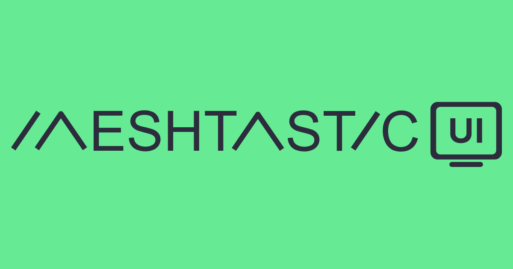
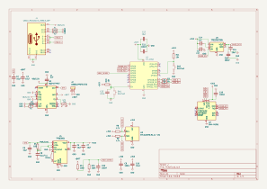

# Custom Meshtastic/Reticulum Node 

A custom Meshtastic compatible LoRa communication device that is designed for off-grid messaging in areas where cellular/internet aren't available such as hiking trails, mountains, and forests. This device provides interface for phones to be able to send messages through long range radio through a decentralized mesh network.  

> [!NOTE]
> Read about progress status in JOURNAL.md

## Hardware Preview

Interactive KiCad viewer powered by [KiCanvas](https://kicanvas.org):

- **[Open schematic in KiCanvas](https://kicanvas.org/?github=https%3A%2F%2Fgithub.com%2Fkyrg4z%2Fcustom-meshtastic-node%2Fblob%2Fmain%2FPCB%2FPCB.kicad_sch)**
- **[Open PCB layout in KiCanvas](https://kicanvas.org/?github=https%3A%2F%2Fgithub.com%2Fkyrg4z%2Fcustom-meshtastic-node%2Fblob%2Fmain%2FPCB%2FPCB.kicad_pcb)** _(board not routed yet — preview will be empty)_

A live, embedded viewer is hosted via GitHub Pages: **https://kyrg4z.github.io/custom-meshtastic-node/**

### Schematic snapshot

Auto-exported from <code>PCB/PCB.kicad_sch</code> by <code>.githooks/pre-commit</code>. Enable it once per clone with <code>git config core.hooksPath .githooks</code>.

